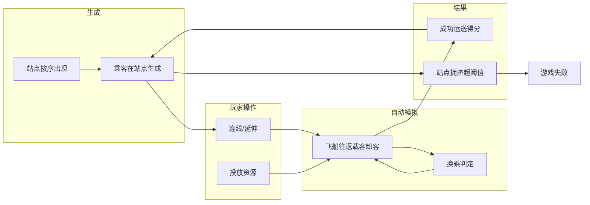
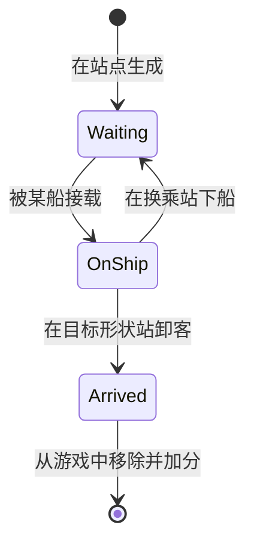

# 星穹铁道 — 产品需求文档（PRD）

> 基于 Mini Metro 启发的 2D 轨道连线运输游戏，为 UI 文档与 Unity 技术实现提供上游需求。  
> 版本：1.2 · 目标：20 天内完成 1–2 个可玩关卡（无尽生存模式）。  
> 1.2 首版简化：不做 Hub 道具（全站可换乘）；不做取消航线（架构预留）；乘客目标站随机；载客先到先上。

---

## 1. 游戏概述

### 1.1 一句话卖点
玩家作为星穹铁道调度者，通过在不同星星（站点）间铺设航线、投放飞船与升级设施，将乘客送往同形状的目的地；在站点拥挤失控前尽可能多地完成运送并得分。

### 1.2 玩家扮演与目标
- **扮演**：轨道网络的规划者与资源投放者（不直接驾驶飞船）。
- **目标**：在无尽生存下持续运营，成功运送乘客得分；避免任一站点拥挤超过阈值导致失败。

### 1.3 与 Mini Metro 的对照与简化
| 维度 | Mini Metro | 星穹铁道（本作） |
|------|------------|------------------|
| 地图 | 河流 + 站点 | 星系图：星星固定位置，陨石带/星隧替代河流与桥 |
| 站点 | 形状表示目的地类型 | 同：形状 = 目的地类型，固定位置按顺序出现 |
| 线路 | 多色线路连接站点 | 同：不同颜色线条表示不同航线 |
| 运载 | 列车在线路往返，自动载客/换乘 | 同：飞船在航线上往返，自动载客/卸客/换乘 |
| 资源 | 随时间获得新车/桥梁/车厢等 | 游戏内「周」发放：飞船、星隧、客舱、空间站 |
| 失败 | 站点积压过久失败 | 同：站点拥挤超阈值即失败 |
| Interchange / Hub | 换乘站提升容量（6→18） | 本作 Hub 仅负责换乘（多线可在此互转），**不提升站点容量** |
| 资源发放方式 | 每周 1 列车 + 从 4 项中选 2 | 每周 1 飞船 + **轮换 1 项**（客舱→星隧→客舱…），首版不含空间站 |
| **简化** | — | 先做 3–4 种形状、3 条航线色；陨石带/星隧第一关可不做障碍；音效/多地图后续迭代 |

---

## 2. 核心循环

### 2.1 玩家视角流程
1. **站点出现**：星星按固定位置与节奏解锁。
2. **乘客生成**：在各星星上生成乘客，头顶显示目标星星的形状。
3. **玩家连线/延伸**：点击两星建立航线（选色）、延伸已有线路；首版暂不支持取消航线。使用每周发放的资源（飞船、星隧、客舱）。
4. **自动运输**：飞船在航线上往返，沿途载客、在匹配形状的星星卸客，支持换乘。
5. **得分与压力**：成功运送得分；站点排队人数超阈值则失败。

### 2.2 核心循环示意（Mermaid）



**图例**：箭头表示流程/阶段先后关系，非严格因果关系；G→B 表示得分后循环继续（乘客继续生成），B→H 表示乘客生成累积后可能导致拥挤。

---

## 3. 地图与生成规则（太阳系关卡）

### 3.1 站点（星星）固定位置与出现节奏

- **地图**：太阳系。中心为太阳，由内向外依次：水星、金星、地球、火星、木星、土星（第一关 7 站；可按工期扩展）。
- **坐标**：星星位置在关卡配置中写死（x, y），运行时直接生成在固定位置，不随机。
- **出现节奏（两阶段）**：  
  - **阶段一（固定节奏，周 0–2）**：按配置的 `unlockAfterWeeks` 在对应周数解锁。开局（周 0）解锁 `unlockAfterWeeks == 0` 的站；周 1 解锁 `== 1` 的站；周 2 解锁 `== 2` 的站。每周可解锁多个站（如周 0 可有多站为 0）。  
  - **阶段二（Mini Metro 风格，周 3 起）**：进入随机池模式。每经过 1 周，从「随机池」中**随机选取 1–2 个**尚未解锁的站并解锁；若池中剩余 ≤ 1 站则全解锁。随机池由配置 `randomPoolStations` 指定；选站顺序每局不同，形成「相对随机」体验。  
  - **周数**：从 0 开始，每经过配置的「一周时长（秒）」+1。
  - **周 0 与首次资源发放**：周 0 持续 60 秒后变为周 1 时**首次发放**资源；开局不发放。即：第 1 次发放发生在「满一周」时（周 0→周 1 的过渡）。
- **开局资源**：首版**不严格**要求「无预设航线与飞船」。默认可无预设；若希望缩短上手时间，可在关卡配置（LevelConfig）中配置 **startGift**（如预设一条示例线太阳–水星，或开局多 1 艘飞船），便于玩家更快上手。

### 3.2 形状与目的地类型
- 每颗星星绑定一种**形状**（即目的地类型）。先做 3–4 种：圆、三角、方、星。
- 行星与形状的对应关系在关卡配置中写死（例如：水星=圆、金星=三角、地球=方……）。多颗星可共用同一形状（如两站都是 Circle）。

### 3.3 乘客生成规则
- **生成位置**：仅在 `isUnlocked == true` 的站点上生成。
- **触发方式**：每站独立计时器；每隔 `乘客生成间隔(秒)` 在该站尝试生成一次；若配置了「每站同时生成数量」N，则一次可生成 N 人（每人生成时独立 roll 目标形状）。
- **目标形状**：每个乘客的 targetShape 在生成时确定。建议均匀或按权重随机（如 4 种形状各 25%）；也可按「当前已解锁站形状比例」加权，避免目标集中某形状。
- **目标站（多星同形状）**：若存在多颗星同为 targetShape，乘客的 targetStationId **首版随机**选一站；后续可扩展为「路径最短」。
- **上限**：始终允许生成，不设 queueCapacity 上限（即允许「超载」以触发失败）。queueCapacity 与 crowdingThreshold 仅用于拥挤/失败判定（见第 7 节），不限制乘客生成。

### 3.4 第一关「太阳系」布局、配置与站点安排（细化）

#### 3.4.1 站点配置表（固定位置）

以下为第一关的完整站点配置；坐标采用 2D 正交，中心 (0, 0) 为太阳。**1 世界单位 = 1 Unity 单位**，用于 `Transform.position`（实现见技术文档 §3.2、§10.1）。

| id | 站点名 | 形状 | 位置 (x, y) | 解锁阶段 | 说明 |
|----|--------|------|-------------|----------|------|
| sun | 太阳 | Circle | (0, 0) | 固定·周 0 | 中心，开局解锁 |
| mercury | 水星 | Triangle | (1.8, 0) | 固定·周 0 | 太阳右侧，开局解锁 |
| venus | 金星 | Square | (2.8, 1.6) | 固定·周 1 | 右上方 |
| earth | 地球 | Star | (3.8, 0) | 固定·周 2 | 太阳正右 |
| mars | 火星 | Circle | (4.2, -1.5) | 随机池 | 右下，周 3 起随机出现 |
| jupiter | 木星 | Triangle | (5.2, 1.0) | 随机池 | 右上外圈 |
| saturn | 土星 | Square | (5.8, -0.8) | 随机池 | 最外圈右下 |

**形状分布**：Circle×2（太阳、火星）、Triangle×2（水星、木星）、Square×2（金星、土星）、Star×1（地球）。同形状多站增加路线规划深度与随机池阶段的变数。

#### 3.4.2 布局示意（自上往下俯视）

```
                   金星(Square)
                      *
           木星(Triangle)  地球(Star)
                 * ---------- *
    水星(Triangle) --- 太阳(Circle) --- (延伸)
                 * ---------- *
                   火星(Circle)  土星(Square)
```

坐标对应关系：太阳 (0,0)；水星在右侧偏近；金星、地球、火星、木星、土星沿「由内向外」的轨道感排布，保证相邻站间有合理连线距离，避免重叠。

#### 3.4.3 第一关专属数值配置（覆盖全局默认值）

未列出的参数使用第 8 节默认值；overrides 与 8 的优先级：第一关配置优先，未覆盖项取 8。

| 参数 | 第一关取值 | 说明 |
|------|------------|------|
| 站点 queueCapacity | 8 | 与全局一致 |
| 站点 crowdingThreshold | 6 | 与全局一致 |
| 乘客生成间隔(秒/站) | 周 0、1 用 6s；自周 2 起用 5s | 前期略宽松，便于熟悉操作；与 3.4.6 passengerSpawnIntervalAfterWeeks 字段一致 |
| 每站同时生成数量 | 1 | 与全局一致 |
| 游戏内 1 周(秒) | 60 | 与全局一致 |
| 飞船容量 | 4 | 与全局一致 |
| 停靠时间(秒) | 1 | 与全局一致 |

#### 3.4.4 乘客目标形状分配（第一关）

- **仅已解锁站点的形状**参与生成：未解锁站点的形状不生成乘客目标。
- **权重**：在已解锁形状中均匀分配。开局 2 站 → Circle/Triangle 各 50%；周 1 加入金星(Square) → C/T/S 各约 33.3%；周 2 加入地球(Star) → C/T/S/Star 各 25%；周 3 起进入随机池，随解锁增加，最终 7 站 4 形状各 25%。
- **多星同形状**：Circle×2（太阳、火星），Triangle×2（水星、木星），Square×2（金星、土星）。乘客 targetShape 确定后，targetStationId **首版随机**选一站；后续可扩展为路径最短。

#### 3.4.5 解锁节奏与难度曲线

**阶段一（固定节奏，周 0–2）**

| 周数 | 新解锁站 | 累计 | 难度说明 |
|------|----------|------|----------|
| 0 | 太阳、水星 | 2 站 | 2 形状，上手期 |
| 1 | 金星 | 3 站 | 3 形状，增加连线选择 |
| 2 | 地球 | 4 站 | 4 形状，需规划星形目的地 |

**阶段二（Mini Metro 风格，周 3 起）**

随机池 = [火星、木星、土星]。**每周**从未解锁池中**随机选取 1–2 个**站点解锁；若剩余 ≤ 1 站则全解锁。每局顺序不同，例如：

- 周 3：火星+木星（2 站）→ 周 4：土星（1 站）→ 7 站全解锁
- 周 3：火星（1 站）→ 周 4：木星+土星（2 站）→ 7 站全解锁
- 周 3：土星（1 站）→ 周 4：火星（1 站）→ 周 5：木星（1 站）→ 7 站全解锁

每周解锁数量：`min(max(1, random(1,2)), 池中剩余数)`。池非空时至少解锁 1 站、最多 2 站，不超过池中剩余数；符合「一周不止多一个」且有一定随机性。

#### 3.4.6 配置数据格式（供实现）

```json
{
  "levelId": "solar_system_01",
  "displayName": "太阳系",
  "stations": [
    {"id": "sun", "displayName": "太阳", "shapeType": "Circle", "position": [0, 0], "unlockPhase": "fixed", "unlockAfterWeeks": 0},
    {"id": "mercury", "displayName": "水星", "shapeType": "Triangle", "position": [1.8, 0], "unlockPhase": "fixed", "unlockAfterWeeks": 0},
    {"id": "venus", "displayName": "金星", "shapeType": "Square", "position": [2.8, 1.6], "unlockPhase": "fixed", "unlockAfterWeeks": 1},
    {"id": "earth", "displayName": "地球", "shapeType": "Star", "position": [3.8, 0], "unlockPhase": "fixed", "unlockAfterWeeks": 2},
    {"id": "mars", "displayName": "火星", "shapeType": "Circle", "position": [4.2, -1.5], "unlockPhase": "random_pool"},
    {"id": "jupiter", "displayName": "木星", "shapeType": "Triangle", "position": [5.2, 1.0], "unlockPhase": "random_pool"},
    {"id": "saturn", "displayName": "土星", "shapeType": "Square", "position": [5.8, -0.8], "unlockPhase": "random_pool"}
  ],
  "randomPoolStations": ["mars", "jupiter", "saturn"],
  "randomUnlockPerWeek": [1, 2],
  "overrides": {
    "passengerSpawnInterval": 6,
    "passengerSpawnIntervalAfterWeeks": 2,
    "passengerSpawnIntervalLate": 5
  }
}
```

**字段说明**

| 字段 | 说明 |
|------|------|
| unlockPhase | "fixed"：按 unlockAfterWeeks 在对应周解锁；"random_pool"：放入随机池，周 3 起随机解锁。unlockPhase=="random_pool" 时 unlockAfterWeeks 忽略 |
| unlockAfterWeeks | 仅 unlockPhase=="fixed" 时有效；0/1/2 表示周数 |
| passengerSpawnInterval | 第一关前 N 周的生成间隔（秒），如 6 |
| passengerSpawnIntervalAfterWeeks | 自第几周起切换；如 2 表示周 0、1 使用 passengerSpawnInterval，**自周 2 起**使用 passengerSpawnIntervalLate（周 2 不包含在「前 2 周」内） |
| passengerSpawnIntervalLate | 周 2 起使用的生成间隔（秒），如 5 |
| randomPoolStations | 随机池站点 id 列表；周 3 起每周从未解锁池中随机取 1–2 站解锁 |
| randomUnlockPerWeek | 每周解锁数量范围 [min, max]，如 [1,2] 表示 1 或 2 站 |

实现时用 ScriptableObject 或 JSON 均可；必填：`id`、`displayName`、`shapeType`、`position`、`unlockPhase`；若 `unlockPhase=="fixed"` 则需 `unlockAfterWeeks`。可选：`startGift`（开局赠送预设线或飞船，见 3.1）。

**第 2 关复用规则**：沿用同一套数据结构；仅替换站点表、randomPoolStations、overrides。地图主题可换（如另一星系），但「固定位置 + 阶段一固定 + 阶段二随机池」规则不变。

### 3.5 陨石带与星隧
- **概念**：陨石带 = 原版河流；星隧 = 原版桥梁，用于跨陨石带连线。
- **首版（20 天）**：可不做障碍逻辑，所有星星间只要连线即可通行；仅保留名词与扩展接口，便于后续加「必须用星隧才能跨区」等规则。

---

## 4. 实体与数据定义及行为逻辑（为代码 / Prefab 准备）

以下每个实体均包含：**数据字段**、**行为逻辑**（触发条件、状态、输出）、**边界与不变式**。实现对应技术文档 §4 Prefab 与组件、§5.2 实体脚本。

---

### 4.1 Station（站点 / 星星）

**数据字段**

| 字段 | 类型/说明 | 备注 |
|------|-----------|------|
| id | 字符串或 int | 关卡内唯一 |
| position | Vector2（固定） | 关卡配置，运行时不变 |
| shapeType | 枚举：Circle / Triangle / Square / Star | 目的地类型，同形状站点可有多颗 |
| displayName | 字符串（如「水星」） | 可选 UI |
| queueCapacity | 整数 | 排队人数上限；超过仍可继续排队，但参与拥挤判定 |
| crowdingThreshold | 整数 | 当前排队人数 ≥ 此值即参与失败判定（建议 ≤ queueCapacity） |
| waitingPassengers | Passenger 列表 | 当前在站台等待的乘客，按「待上船」顺序维护 |
| isUnlocked | bool | 由关卡节奏或周数驱动，见 3.1 站点出现节奏 |
| hub | Hub 引用，可空 | 首版预留；首版全站可换乘，不依赖 Hub |

**行为逻辑**

| 行为 | 触发条件 | 执行内容 | 输出/副作用 |
|------|----------|----------|--------------|
| 解锁 | 阶段一：周数 = unlockAfterWeeks 且 unlockPhase=="fixed"；阶段二：周 3 起，每周末从 randomPoolStations 中随机取 1–2 站解锁 | 设置 isUnlocked = true | 该站可被连线、可生成乘客、可被选为空间站放置目标 |
| 生成乘客 | 每站独立计时器达到生成间隔且 isUnlocked | 创建新 Passenger：目标形状按配置权重或均匀；目标站为「同形状」中的一站（见 3.3）；加入 waitingPassengers 队尾。不检查 queueCapacity，始终允许生成（与 3.3 一致） | 排队人数 +1 |
| 拥挤判定 | 每帧或每秒检查 | 若 waitingPassengers.Count ≥ crowdingThreshold，参与失败判定（见 7.2） | 可能触发游戏失败 |
| 可被连线 | 玩家操作「连线」时 | 仅当 isUnlocked 的站可作为连线端点 | — |
| 乘客上船 | 由 Ship 停靠时驱动（见 4.4） | 从 waitingPassengers 中按载客策略取走若干乘客，移入船内 | 排队人数减少 |
| 乘客下船（目的地） | 由 Ship 停靠时驱动 | 船将「目标为此站形状」的乘客卸下，记为到达，不再回到本站队列 | 得分 +1/人 |
| 乘客下船（换乘） | 由 Ship 停靠时驱动；首版在任意多线共站即可换乘，不检查 Hub | 船将「需在此换乘」的乘客移入本站 waitingPassengers 队尾 | 排队人数增加 |

**不变式**

- `waitingPassengers.Count` 在任意时刻可大于 `queueCapacity`（设计上允许超载以触发失败），但不应为负。
- 仅 `isUnlocked == true` 的站出现在「可点击连线」与「乘客生成」逻辑中。

---

### 4.2 Passenger（乘客）

**数据字段**

| 字段 | 类型/说明 | 备注 |
|------|-----------|------|
| id | 唯一标识 | 用于调试与事件 |
| targetShape | 枚举，与 Station.shapeType 同 | 需运送到「任意一颗该形状的星星」 |
| targetStationId | 可选，站点 id | 若多星同形状，可在一生成时固定目标站，便于路径计算 |
| state | 枚举：Waiting / OnShip / Arrived | 状态机，见下 |
| currentStation | Station 引用，可空 | state==Waiting 时有效 |
| currentShip | Ship 引用，可空 | state==OnShip 时有效 |

**状态机**



**行为逻辑**

| 行为 | 触发条件 | 执行内容 | 输出/副作用 |
|------|----------|----------|--------------|
| 生成 | 见 Station「生成乘客」 | 设 state=Waiting，currentStation=生成站，targetShape 按规则定；若多星同形状则 targetStationId **首版随机**选一站 | 加入该站 waitingPassengers |
| 上船 | Ship 停靠且该乘客被载客策略选中、船未满、乘客可达 | currentStation 从队列移除该乘客；state=OnShip，currentShip=该船；船载客列表加入此人 | 站排队 -1，船载客 +1 |
| 下船（到达） | Ship 停靠在「目标形状」站 | state=Arrived；从船载客列表移除；触发得分事件；对象可销毁或回收 | 全局分数 +1 |
| 下船（换乘） | Ship 停靠在有多条 Line 经停的站且路径需在此换乘（首版全站可换乘） | state 保持 Waiting；currentStation=本站；加入本站 waitingPassengers 队尾；currentShip=null | 站排队 +1，船载客 -1 |
| 移除 | state==Arrived 后 | 不再参与任何逻辑，从场景与数据结构中移除 | — |

**边界**

- 同一乘客同一时刻只属于一个 Station 或一个 Ship。
- 换乘后该乘客重新参与「载客策略」排序，可能与新站其他乘客竞争上船。

---

### 4.3 Line（航线）

**数据字段**

| 字段 | 类型/说明 | 备注 |
|------|-----------|------|
| id | 唯一标识 | — |
| color | 枚举或 Color（3 色之一） | 与其它 Line 区分 |
| stationSequence | Station 有序列表 | 表示路径顺序，飞船按此往返；相邻两项即「一段」 |
| ships | Ship 列表 | 绑定在此线上的所有飞船 |
| segmentsPendingRemoval | (Station, Station) 集合，可空 | 首版预留，取消航线扩展用；已请求取消、等待「走完当前线段」的段；走完后从 stationSequence 中移除 |

**行为逻辑**

| 行为 | 触发条件 | 执行内容 | 输出/副作用 |
|------|----------|----------|--------------|
| 新建线段（新线） | 玩家选择两站 A、B 并选色，且当前不存在「颜色 C 且包含 A–B 相邻」的线 | 创建新 Line：color=C，stationSequence=[A,B]，ships=[] | 场景出现一条新颜色线，无船 |
| 新建线段（延伸） | 玩家选择两站 A、B 并选色 C；已存在某 Line 颜色为 C 且其 stationSequence 的**首站**或**末站**为 A 或 B | **首端插入**：若首站为 A 则插入 B 得 [B,A,…]，若首站为 B 则插入 A 得 [A,B,…]；**末端追加**：若末站为 A 则追加 B 得 […,A,B]，若末站为 B 则追加 A 得 […,B,A] | 该线路径变长，原有船自动在新段上也可运行 |
| 选色规则 | 每条 Line 仅一种颜色；不同 Line 可连接同一对 A–B，但颜色必须不同 | 同色仅一条 Line；A–B 间同色只能有一条边（不能重复建同色 A–B） | — |
| 请求取消段 | （首版不做，扩展预留） | 玩家点击某段并确认取消；将 (P,Q) 加入 segmentsPendingRemoval；该段在路径计算中仍存在，直到「走完」 | — |
| 真正移除段 | （首版不做，扩展预留） | 所有正在该段上的飞船均已完成该段后，从 stationSequence 中移除 P–Q 相邻关系；从 segmentsPendingRemoval 移除 (P,Q) | — |

**边界与规则补充**

- **延伸规则**：仅当「当前选中的一端是某线的端点」时，才可延伸该线；若 A、B 都在某线中间，则不允许用该线延伸，需新建另一条线（新颜色）。
- **取消后路径（首版策略）**：若 stationSequence 去掉 P–Q 后变成两段不连通的序列（如 [A,B,C] 去 B–C 得 [A,B] 与 [C]），**保留站点数较多的一段**为该 Line 的 stationSequence，**较短一段废弃**。废弃段上的站点（如 C）在该 Line 上**视为不可用**（该 Line 不再经停），但**站点本身仍存在**于地图中，可被其它 Line 连接。若某船因此「不在任何段上」则将该船移到最近端点站，设为 Docked 等待玩家重新分配或下一帧沿剩余段继续。4.3、5.5、6.2 统一采用此规则。
- **不变式**：stationSequence 中相邻站点在几何上「有直接连线」；ships 中每艘船的当前段 (A,B) 必须是 stationSequence 中某对相邻站。

---

### 4.4 Ship（飞船）

**数据字段**

| 字段 | 类型/说明 | 备注 |
|------|-----------|------|
| id | 唯一标识 | — |
| line | Line 引用 | 所属航线 |
| speed | float | 移动速度（单位/秒），来源：第 8 节全局配置或 Line 级别配置 |
| capacity | 整数 | 当前最大载客数（客舱升级增加） |
| passengers | Passenger 列表 | 当前载客，数量 ≤ capacity |
| currentSegmentIndex | int | 在 line.stationSequence 中的「当前段」索引，即 [stationSequence[i], stationSequence[i+1]] |
| direction | int，1 或 -1 | 1=沿序列正向，-1=反向；到端点调头 |
| progressOnSegment | float，0~1 | 在当前段上的插值位置，0=起点站，1=终点站 |
| state | 枚举：Moving / Docked | 移动中 / 停靠中 |
| dockRemainingTime | float | 停靠剩余时间（秒），Docked 时递减 |

**行为逻辑**

| 行为 | 触发条件 | 执行内容 | 输出/副作用 |
|------|----------|----------|--------------|
| 移动更新（每帧） | state==Moving | 按 line 上相邻站 A→B 做插值：segmentLength = 两站间几何距离；progressOnSegment += direction * speed * deltaTime / segmentLength；若 progressOnSegment ≥ 1 或 ≤ 0，则到达端点站，转为 Docked，dockRemainingTime = 停靠时间配置 | — |
| 停靠开始 | 到达某站（端点或中间站） | state=Docked；当前站 = 根据 direction 和 currentSegmentIndex 确定；执行**卸客→载客**（见第 5 节）。**首版：飞船在航线上每站必停**，不做 Mini Metro 式的「空站可跳过」逻辑 | 可能改变 passengers 与各站 waitingPassengers |
| 停靠结束 | dockRemainingTime ≤ 0 | state=Moving；若当前站为 line.stationSequence 的端点，direction *= -1（调头）；progressOnSegment 保持 0 或 1，下一帧沿新段移动 | — |
| 段被取消 | （首版不做，扩展预留） | 当前段进入 segmentsPendingRemoval 时，本船照常「走完当前段」到端点，然后该段被移除 | — |

**载客容量**

- 初始 capacity = 配置的「飞船容量」；玩家对该船使用「客舱」资源后，capacity += 配置的「客舱升级增量」。

**不变式**

- `passengers.Count <= capacity`；停靠时先卸后装，装到满或无可载乘客为止。
- 船始终在 line.stationSequence 的某一段上（或刚停靠在该段端点），且该段未从 segmentsPendingRemoval 真正移除前仍视为有效。

---

### 4.5 Hub（空间站 / 换乘枢纽）

**首版不做 Hub 道具**；数据结构与接口预留，换乘按全站可换乘实现（任意多线共站即可换乘，不依赖 Hub）。

**数据字段（扩展预留）**

| 字段 | 类型/说明 | 备注 |
|------|-----------|------|
| station | Station 引用 | 唯一所在站；每站至多一个 Hub |
| linesPassingThrough | Line 列表（只读） | 所有「stationSequence 包含该站」的 Line；由运行时根据当前线路图推导，不必持久化 |

**行为逻辑**

| 行为 | 触发条件 | 执行内容 | 输出/副作用 |
|------|----------|----------|--------------|
| 放置 | 玩家使用「空间站」资源并点击某站 S | 若 S 上尚无 Hub：在 S 上创建 Hub，扣减资源；若 S 已有 Hub，不允许放置 | 该站成为换乘站 |
| 路径计算 | 计算乘客「从 A 站到目标形状」的可达性时 | 经过该站的任意 Line 之间可「换乘」：即从 Line1 的船下船后，可上 Line2 的船（若 Line2 也经过该站） | 见第 5 节可达性 |

**不变式**

- 每个 Station 最多关联 0 或 1 个 Hub。

---

### 4.6 Resource（资源道具）

**数据字段（全局或 GameManager）**

| 字段 | 类型/说明 | 备注 |
|------|-----------|------|
| shipCount, starTunnelCount, carriageCount, hubCount | 非负整数 | 当前持有数量 |

**行为逻辑**

| 行为 | 触发条件 | 执行内容 | 输出/副作用 |
|------|----------|----------|--------------|
| 发放 | 游戏内「周」计时器到达一周（周 0 持续 60 秒后首次发放，之后每 60 秒一次） | 按配置增加：shipCount += 1；另**轮换**发放一项：**首版**客舱→星隧→客舱…（不含空间站）；弹出本周奖励 UI | — |
| 使用·飞船 | 玩家在「放置飞船」模式下点击某条 Line | 若 shipCount ≥ 1：shipCount -= 1；在该 Line 上生成一艘新 Ship。新船初始：currentSegmentIndex=0，direction=1，progressOnSegment=0，state=Moving，位置在 stationSequence[0] | 该线多一艘船 |
| 使用·客舱 | 玩家在「放置客舱」模式下点击某艘 Ship | 若 carriageCount ≥ 1：carriageCount -= 1；该 Ship.capacity += 配置增量 | — |
| 使用·空间站 | （首版不做） | 玩家在「放置空间站」模式下点击某 Station；若 hubCount ≥ 1 且该站无 Hub：hubCount -= 1，在该站创建 Hub | 扩展预留 |
| 使用·星隧 | 首关可不实现 | 若实现：跨陨石带连线时消耗 starTunnelCount | — |

**前置条件汇总**

- 放置飞船：至少存在一条 Line（stationSequence 长度 ≥ 2）。新建 Line 时 ships=[]，玩家需用资源放置第一艘船后该线才有船运行。
- 放置客舱：至少存在一艘 Ship。
- 放置空间站：（首版不做）目标站已解锁且该站尚无 Hub。

---

## 5. 运输与换乘规则（最难点拆清）

### 5.1 停靠时执行顺序（单船单站）

飞船在某站进入 **Docked** 状态后，每帧或按固定时间步长更新 `dockRemainingTime`，在**同一帧内**按以下顺序执行一次（仅一次）逻辑，再在倒计时结束后离开：

1. **卸客·目的地**  
   遍历船上所有乘客：若当前站的 `shapeType == 乘客.targetShape`，则该乘客在此站**到达**：从船 passengers 移除，state=Arrived，触发得分 +1，对象移除。
2. **卸客·换乘**  
   遍历船上剩余乘客：从当前站出发，用当前线路图做路径搜索；**首版**：若当前站有**多条 Line 经停**，且该乘客无法通过当前船所在 Line 直达目标形状，且存在「从当前站换乘其他 Line 可到达目标形状」的路径，则该乘客在此站**换乘下船**：从船 passengers 移除，加入当前站 waitingPassengers 队尾，state=Waiting，currentStation=当前站。（首版全站可换乘，不检查 Hub）
3. **载客**  
   对当前站 waitingPassengers 按**载客优先级**排序（见 5.2），依次尝试：若乘客目标可达且船未满，则将该乘客从站队列移除、加入船 passengers，state=OnShip，currentShip=本船。直到船满或无可达乘客为止。

同一站多艘船时：按**固定顺序**依次执行上述三步——先按 Line.id 字典序，再按 Ship.id 字典序；多船同时到站采用此 tie-break。每轮载客后已上船的从 waitingPassengers 移除，下一艘船看到的队列已更新，避免同一乘客被两船同时接走。

### 5.2 可达性判定

- **输入**：起点站 S、目标形状 T、当前所有 Line（含 stationSequence）。
- **规则**：从 S 出发，可沿「任意 Line 上相邻站」移动；**首版**：任意共站多线均可换乘（不依赖 Hub），即经过某站时若有多条 Line 经停，可在此换线。若存在一条路径到达「shapeType == T」的任意站点，则称**从 S 到目标形状 T 可达**。
- **实现**：BFS/DFS。节点=Station，边=同线相邻站 + 同站多线连通（首版所有站均可换乘）。

### 5.3 载客优先级（同一站排队乘客）

对当前站 `waitingPassengers` 排序后依次尝试上船（船未满且该乘客可达则上）：

- **首版**：**先到先上**（队列原顺序），不做路径计算。
- **扩展预留**：直达优先 → 换乘次数少优先 → 同权（先到先上或随机）。

排序在**每次载客前**对该站当前队列做一次即可（首版仅需保持队列顺序，不必做路径排序）。

### 5.4 卸客策略小结

| 站点类型 | 船上乘客条件 | 行为 |
|----------|--------------|------|
| 当前站形状 == 乘客.targetShape | 目的地到达 | 卸客，Arrived，加分，移除 |
| 当前站有多条 Line 经停，且乘客需换乘才能到 targetShape | 换乘 | 卸客，加入站队列 Waiting（首版多线共站即可换乘，不检查 Hub） |
| 其他 | — | 不卸客，留在船上 |

### 5.5 边界与失败处理

- **无可达路径**：该乘客永不主动上船（载客时跳过）；一直在站台排队，参与拥挤判定，直至失败或后续线路变化后变为可达。
- **取消航线**：（首版不做，扩展预留）见 4.3「真正移除段」；船在段上时继续跑完该段再移除该段。
- **线路断开导致船「悬空」**：按 4.3「取消后路径」规则，保留站点数较多的一段；船若原在废弃段上，到达端点后移至最近端点站，设为 Docked；下一帧可沿剩余段继续（若仍有相邻段）或等待玩家分配。

---

## 6. 玩家操作与交互（为 UI / 输入实现准备）

### 6.1 连线（建线 / 延伸）

**操作流程**

1. 玩家点击站点 A（必须 `A.isUnlocked`）→ 进入「已选第一站」状态，A 高亮。
2. 玩家再点击站点 B（必须 `B.isUnlocked`，且 B ≠ A）→ 弹出选色面板（3 色）。
3. 玩家选择颜色 C → 执行建线逻辑；**选色面板取消**（点击取消或关闭）→ 清除第一站高亮、退出建线模式，不建线。

**建线逻辑（选色 C 后）**

- **前置**：A、B 已解锁；不存在「颜色为 C 且 stationSequence 中包含相邻 A–B」的 Line（即同色 A–B 段不重复）。
- **新线**：若不存在任何 Line 的颜色为 C，则创建新 Line：color=C，stationSequence=[A, B]，ships=[]。
- **延伸**：若已存在颜色为 C 的 Line L，且 L.stationSequence 的**首站**或**末站**为 A 或 B：  
  - 若首站为 A，则在首端插入 B，得到 [B, A, …]；若首站为 B，则插入 A，得到 [A, B, …]。  
  - 若末站为 A，则在末端追加 B，得到 […, A, B]；若末站为 B，则追加 A，得到 […, B, A]。  
  - 若 A、B 都不是 L 的端点，则不允许用 L 延伸；首版采用「同色仅一条线」，应提示「请选择其他颜色，或将新站连到现有线路端点」。  
- **反馈**：场景立即绘制 A–B 的 C 色线段；若该 Line 上已有船，船在新段上也可通行（路径已更新）。

**边界**

- 不允许 A、B 为同一点；不允许重复建立「同色且同段 A–B」。
- 若当前仅有「中间站」与 B 相连（即没有以 A 或 B 为端点的 C 色线），首版可规定：只允许「新线」即新建 [A,B]，不自动延伸。
- **首版产品约定**：同色仅一条线（每种颜色对应唯一一条 Line）。若已存在颜色 C 的线且 A、B 均非其端点，则不允许新建同色第二条线，应提示「请选择其他颜色，或将新站连到现有线路端点」。

### 6.2 取消航线（段）

**首版不做**；规则与数据结构（4.3 segmentsPendingRemoval、取消后路径等）已预留，支持日后实现。

**操作流程（扩展预留）**

1. 玩家点击某条「线段」（即两相邻站 P–Q 之间的线），或先选中某 Line 再选中该段 → 弹出确认「取消该段？」。
2. 玩家确认 → 将该段 (P, Q) 加入该 Line 的 segmentsPendingRemoval；视觉上该段标为「取消中」（虚线/半透明）。
3. 当所有正在 (P,Q) 段上的飞船都到达 P 或 Q 后，从 Line.stationSequence 中移除 P–Q 相邻关系，并从 segmentsPendingRemoval 移除；视觉上该段消失。

**边界**

- 若移除后 Line 的 stationSequence 变成两段不连续，按 4.3「取消后路径」规则：保留站点数较多的一段，较短一段废弃；船若原在该段上，到达端点后按 4.3 处理。

### 6.3 资源使用

**发放**

- **触发**：游戏内周计时器每达到「一周时长」一次。
- **效果**：shipCount += 1；另按轮换规则发放一项：**首版**客舱→星隧→客舱…（不含空间站）；弹出「本周奖励」UI（见 4.6、第 8 节）。

**放置·飞船**

- **前置**：shipCount ≥ 1；存在至少一条 Line 且其 stationSequence 长度 ≥ 2。
- **操作**：玩家点击资源栏「飞船」进入放置模式；再点击某条 Line → 扣减 shipCount，在该 Line 上生成一艘新 Ship（位置、方向见 4.6）。

**放置·客舱**

- **前置**：carriageCount ≥ 1；存在至少一艘 Ship。
- **操作**：玩家点击「客舱」后点击某艘 Ship → 扣减 carriageCount，该 Ship.capacity += 配置增量。

**放置·空间站**（首版不做）

- **前置**：hubCount ≥ 1；目标站已解锁且该站尚无 Hub。
- **操作**：玩家点击「空间站」后点击某站 → 扣减 hubCount，在该站创建 Hub。首版不实现。

**星隧**：首关不做陨石带障碍逻辑；资源栏中**显示**星隧，数量为 0。若后续实现跨陨石带连线，则在使用时扣减 starTunnelCount。

### 6.4 信息展示（为 UI 文档打底）
- 站点：当前排队人数、拥挤度条或颜色、该站形状图标；未解锁站灰显或不显示排队信息。
- 乘客：头顶目标形状图标。
- 航线：颜色、站点顺序、该线上的船数量及位置；取消中的段用虚线/半透明区分。
- 资源栏：当前飞船/客舱/星隧数量；首版不含空间站（或显示为 0）；**首关星隧在资源栏中显示，数量为 0**；下次「周」发放倒计时（可选）。

→ 技术文档 §5.4、§10

---

## 7. 得分与失败

### 7.1 得分
- **规则**：每成功运送 1 名乘客（到达同形状站点并卸客，Passenger.state 变为 Arrived）计 1 分（或可配置分值）。
- **触发时机**：在 Ship 停靠执行「卸客·目的地」时，每卸下一人即触发一次加分事件（供 UI 与存档使用）。
- **可选**：连击、效率加成等延后做；首版只做「每人 1 分」。

### 7.2 失败
- **条件**：任一**已解锁**站点满足「当前排队人数 ≥ 该站 crowdingThreshold」。
- **判定频率**：每帧或每隔固定间隔（如 0.5 秒）检查一次；一旦有站满足条件：  
  - 若配置「拥挤持续失败时间」= 0：立即触发失败。  
  - 若配置 > 0：该站进入「危险」状态并开始计时；若在持续时间内排队人数降至阈值以下则清除危险；若持续超过该时间则触发失败。
- **反馈**：触发失败时，高亮或闪烁导致失败的站点；停止游戏逻辑（不再生成乘客、船不再移动、不再发放资源）；弹出失败/结算界面，显示本局得分与「重试」「返回」。
- **失败后**：不再响应玩法操作（连线、取消、放置资源）；仅响应结算界面按钮。

### 7.3 全局时序与数据不变式

**每帧/每步建议顺序（未失败时）**

1. 周计时器更新；若满一周则发放资源并弹 UI。
2. 站点解锁检查：阶段一（周 0–2）按 unlockAfterWeeks；阶段二（周 3 起）从 randomPoolStations 随机取 1–2 站解锁。
3. 各站乘客生成计时器更新，满足间隔则生成乘客。
4. 所有 Ship 更新：Moving 的移动，Docked 的倒计时；到达新站时执行卸客→载客，再在倒计时结束后离站。
5. 取消中的线段检查：（首版不执行，扩展预留）若该段上已无船，则真正移除段并更新 Line。
6. 拥挤/失败检查：各站排队人数与阈值比较，满足则触发失败。

**数据不变式（实现时应始终满足）**

- 任意 Station：`waitingPassengers` 中每个乘客的 `currentStation == 该站` 且 `state == Waiting`。
- 任意 Ship：`passengers.Count <= capacity`；每个乘客的 `state == OnShip` 且 `currentShip == 该船`。
- 任意 Passenger：只属于一个 Station（在队中）或一个 Ship（在船内），或已 Arrived 并即将移除。
- Line：`stationSequence` 中相邻两项在逻辑上表示一条可通行的段；`segmentsPendingRemoval` 中的段仍保留在 `stationSequence` 中直到「走完」后移除。

→ 技术文档 §5.1、§5.4、§7

---

## 8. 数值与可配置参数清单（供调参）

以下均为建议默认值，实现时做 ScriptableObject 或配置文件即可。

| 参数 | 默认值 | 范围/说明 | 对难度的影响 |
|------|--------|-----------|--------------|
| 站点排队上限 | 8 | 4–16 | 越大越不易拥挤 |
| 站点拥挤阈值 | 6 | 2–10，≤ 排队上限 | 越小越易失败 |
| 拥挤持续失败时间(秒) | 0（立即失败） | 0 或 3–10 | 0=严格，>0=给缓冲 |
| 乘客生成间隔(秒/站) | 5 | 2–15 | 越小压力越大 |
| 每站同时生成数量 | 1 | 1–3 | 越大压力越大 |
| 游戏内 1 周(秒) | 60 | 30–120 | 越大资源来得越慢 |
| 每周发放：飞船 | 1 | 0–2 | 核心资源 |
| 每周发放：客舱/空间站/星隧 | 首版轮换客舱→星隧→客舱…（不含空间站）；扩展后可含空间站 | — | 影响运力与换乘 |
| 飞船容量(人) | 4 | 2–8 | 客舱升级在此基础上加 |
| 客舱升级增量 | +2 | +1～+4 | 单船运力 |
| 飞船移动速度 | 1.5 单位/秒 | 0.5–3 | 越大周转越快 |
| 停靠时间(秒) | 1 | 0.5–2 | 越大节奏越慢 |
| 新站点解锁间隔(周或分) | （预留） | 当前采用 3.1 两阶段：周 0–2 固定、周 3 起随机池；此参数后续可扩展为「随机池阶段」的间隔 | — |
| 形状类型数量 | 4 | 3–5 | 影响路线规划复杂度 |
| 航线颜色数量 | 3 | 3–5 | 影响辨识度 |

---

## 9. 首版（20 天）范围与不做清单

### 9.1 本阶段必做
- 太阳系单张地图、星星固定位置；两阶段解锁（周 0–2 固定、周 3 起随机池，每周 1–2 站）。开局无预设航线与飞船，玩家建线后放置飞船。
- 3–4 种形状、3 条航线颜色；**连线与延伸**（暂不支持取消）。
- 乘客生成、头顶目标形状、飞船自动往返、载客/卸客与**换乘（全站可换乘，不含 Hub 道具）**。
- 资源：游戏内周、发放飞船+客舱/星隧；放置飞船、客舱（不含空间站）。
- 得分（每人 1 分）、失败（站点拥挤超阈值）、结算界面。

### 9.2 先不做 / 用简化
- **Hub/空间站道具**：首版不做；全站可换乘；数据结构与逻辑预留。
- **取消航线（段）**：首版不做；**仅预留接口与数据结构**（如 Line.segmentsPendingRemoval、LineManager.RequestRemoveSegment 占位），不实现 UI 与交互，支持日后实现。
- **陨石带障碍与星隧**：第一关不做「必须星隧才能跨区」，仅保留名称与扩展点。
- **音效与多地图**：有时间再加；美术从简（几类形状、几色线、一张背景即可）。
- **乘客超时/连击/效率加成**：可选，首版可不做。
- **航线颜色**：不做复杂选色 UI，预设 3 色轮换或简单选择即可。

### 9.3 美术资源与扩展约定

- **美术资源**：同意使用 Unity 内置形状或占位色块先行；**需提供修改方法与扩展空间**，便于后续简单换图、添加动画。
- **实现约定**：采用集中视觉配置（如 VisualConfig ScriptableObject）、Prefab 子节点（Visual/Body）与 Animator 预留等，使换图与动画扩展无需改业务代码；详见技术文档「美术修改方法与扩展空间」。
- **实现环境**：Unity 2022.3.62f1c1（或同系列 LTS）；ScriptableObject 与 2D 包 API 按此版本。

---

## 10. 任务拆分建议（三人分工落地映射）

| 负责人 | 模块 | 主要产出 |
|--------|------|----------|
| **A** | 站点 + 乘客 + 基础 UI 信息 | 星星 Prefab（形状/位置）、乘客生成逻辑、头顶目标形状、站点拥挤度显示、资源栏与发放提示、结算界面 |
| **B** | 连线 + 线路编辑 + 动画 | 点击两站建线、选色、延伸已有线路；航线绘制与飞船沿线路移动动画；取消航线为首版扩展预留 |
| **C** | 运输算法 + 换乘 + 失败与得分 | 可达性（路径）算法、载客/卸客/换乘逻辑、Hub 与多线换乘、失败判定与得分累计、与 A 的 UI 对接（分数、失败提示） |

三人共用：关卡配置（太阳系站点坐标、形状绑定、解锁顺序）、资源周与发放、Ship/Line/Station/Passenger 等数据结构约定（可先由 C 定接口，A/B 按接口接）。

**实现约定**（落地时必守，详见技术文档）：LevelLoader 为**静态工具类**、不挂到场景；场景须含 **Stations** 根节点（或 Map/Stations）；选色等 UI 优先复用已有 Canvas，避免重复创建；LineManager 绘制时过滤已销毁站点、材质与 Shader 需做空检查。见技术文档 §3.1、§5.1、§10.2、§10.6。

---

*文档结束。后续可据此撰写 UI 文档（界面层级、控件、状态）与技术文档（Prefab/脚本清单、数据流、Unity 实现要点）。*
