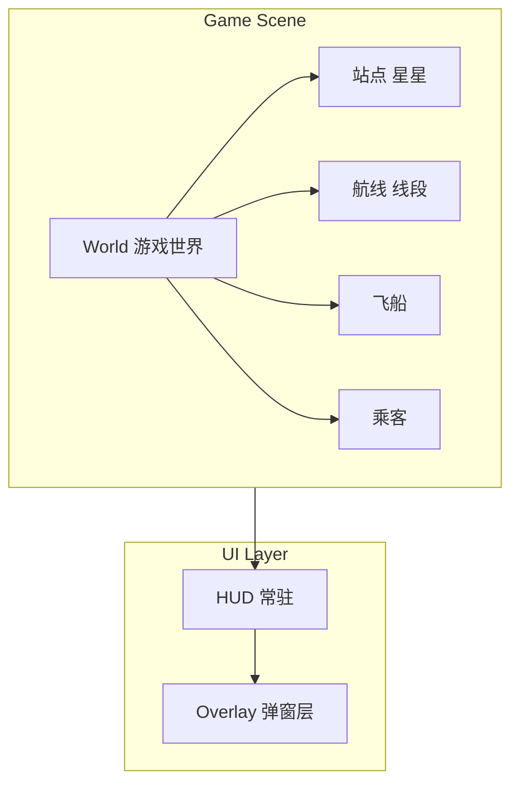
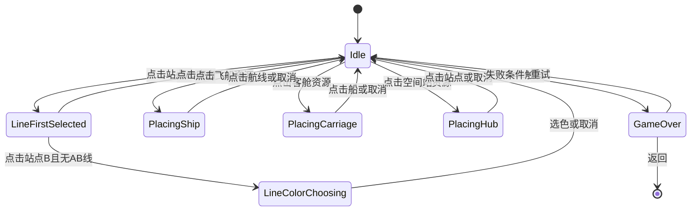

# 星穹铁道 — UI 设计文档（技术实施版）

> 上游需求：[PRD_星穹铁道.md](PRD_星穹铁道.md)。本文档定义界面层级、控件规格、状态机与实现清单，供 **技术端 Agent / Unity 实现** 与美术对接。  
> **版本**：1.1 · **精细化目标**：每个界面与控件具备明确的数据源、事件、边界条件与实施检查项。

---

## 0. 面向 Agent 的实施说明

### 0.1 文档使用方式

| 用途 | 查阅章节 | 说明 |
|------|----------|------|
| 建场景层级与 Canvas | §2 | 按层级创建 GameObject，Overlay 的 Sorting Order 高于 HUD |
| 实现具体控件 | §3 + §7 | 控件规格表含 Unity 组件类型、数据绑定、事件名 |
| 实现 UI 状态机 | §4 | 仅允许表中列出的状态转换；其余视为非法 |
| 对接游戏逻辑 | §4.3 + §7 数据源列 | 订阅表中「数据源/事件」，在回调中更新 UI |
| 自检与验收 | §8 | 按检查清单逐项验证 |

### 0.2 命名规范（必须遵守）

| 对象类型 | 规范 | 示例 |
|----------|------|------|
| **GameObject** | PascalCase，见 §6 清单 | `StationView`, `ScoreText`, `LineColorPanel` |
| **Prefab 资源** | 与 GameObject 同名，放于指定文件夹 | `Assets/Prefabs/UI/StationView.prefab` |
| **C# 脚本** | 与主控件同名 + View/Panel/Controller 后缀 | `StationView.cs`, `LineColorPanel.cs`, `GameplayUIController.cs` |
| **UI 状态枚举** | 与 §4.1 完全一致 | `GameUIState.Idle`, `GameUIState.LineFirstSelected` |
| **事件/委托名** | On + 动作过去式 或 名词 | `OnPassengerDelivered`, `OnWeekElapsed`, `OnStationOvercrowded` |

### 0.3 数据绑定约定

- **只读展示**：由 Game 层在事件回调中调用 `View.SetXXX(value)`，UI 不直接引用 Game 数据结构。
- **交互触发**：View 发出事件（如 `OnStationClicked(StationId)`），由 `GameplayUIController` 或 GameManager 订阅并执行逻辑，再通过事件回调更新 UI。
- **枚举与 PRD 一致**：站点形状用 `ShapeType`（Circle/Triangle/Square/Star），航线颜色用 `LineColor`（Red/Green/Blue 或项目约定枚举）。
- **数量与阈值**：排队人数、拥挤阈值、资源数量等均为 `int`；时间、倒计时为 `float`（秒）。

---

## 2. 界面层级与场景结构

### 2.1 层级关系（由底到顶）

| 层级 | 内容 | 说明 |
|------|------|------|
| **World** | 星星、航线、飞船、乘客 | 游戏世界节点，可带简单 UI（头顶图标、进度条） |
| **HUD** | 分数、资源栏、周倒计时、当前操作提示 | 常驻，不阻挡世界点击（或使用 Raycast 控制） |
| **Overlay** | 选色面板、资源放置确认、本周奖励提示、失败/结算 | 弹出时可暂停或半透明遮罩，需明确关闭/确认 |

### 2.2 界面清单与出现时机

| 界面/区块 | 出现时机 | 关闭条件 |
|-----------|----------|----------|
| 主玩法视图 | 进入关卡后 | 失败或退出关卡 |
| HUD（分数/资源/倒计时） | 与主玩法同时 | 同上 |
| 选色面板（连线时） | 点击第二站建立新线时 | 选择一种颜色 或 取消 |
| 本周奖励提示 | 每经过 1 游戏周 | 玩家点击「确定」或 3–5 秒自动关闭 |
| 资源放置（飞船/客舱/空间站） | 玩家点击资源图标进入「放置模式」 | 完成放置 或 取消 |
| 失败界面 | 站点拥挤超阈值触发失败 | 点击「重试」或「返回」 |
| 结算界面 | 同失败界面，或未来「关卡目标达成」 | 同上 |

---

## 3. 各界面/区块的控件与交互

### 3.1 主玩法视图（World）

| 元素 | 类型 | 行为与反馈 |
|------|------|------------|
| **星星（站点）** | 可点击 Sprite/Shape | 显示该站形状；点击参与「连线」或「放置空间站」；未解锁时灰显或不可点 |
| **站点排队人数** | 数字或圆点 | 显示在当前排队人数；接近/超过拥挤阈值时变色（如黄→红） |
| **拥挤度条** | 进度条（可选） | 填充比例 = 当前人数/拥挤阈值，超 100% 时高亮或闪烁 |
| **航线** | 线段/LineRenderer | 颜色对应线路；取消中：虚线或半透明 |
| **飞船** | Sprite/动画 | 沿航线移动；可选显示当前载客数（小数字） |
| **乘客** | 小单位 + 头顶图标 | 头顶固定显示「目标形状」图标；在站台排队时可见，上船后可在船内或隐藏 |

**点击逻辑（与 HUD 协同）**  
- 第一击：选中站点 A（高亮）。  
- 第二击站点 B：若 A≠B 且无现有 A–B 线，则弹出**选色面板**；若已有 A–B 线，则可选「取消该段」（再确认或直接进入取消中）。  
- 点击空白：取消当前选中的站点/航线。

### 3.2 HUD（常驻）

| 区块 | 控件 | 说明 |
|------|------|------|
| **分数** | 文本 "Score: N" 或图标+数字 | 实时更新，成功运送时可有短暂 +1 动画 |
| **资源栏** | 4 个图标+数量（飞船、星隧、客舱、空间站） | 点击图标进入「放置模式」；数量为 0 时灰显不可点（星隧首关可隐藏） |
| **周倒计时** | 文本 "Next week: 0:45" 或进度环 | 下次发放资源剩余时间；到 0 时触发发放并弹出「本周奖励」 |
| **当前操作提示** | 小字文本（可选） | 如 "点击两个星星连线" / "选择航线以放置飞船" |

布局建议：分数左上或右上；资源栏+倒计时底部横条或右上角集中。

### 3.3 选色面板（Overlay）

| 控件 | 行为 |
|------|------|
| 3 个色块按钮 | 对应 3 条航线颜色；点击后确认建线并关闭面板 |
| 「取消」按钮 | 取消本次连线，关闭面板，清除站点选中状态 |

触发：玩家点击第二个站点且这两站之间尚无该颜色航线时弹出。若两站间已有某线，可改为「添加另一颜色」或仅允许取消该段，逻辑与 PRD 6.1 一致即可。

### 3.4 本周奖励提示（Overlay）

| 控件 | 行为 |
|------|------|
| 标题 | "本周奖励" 或 "Week N" |
| 奖励列表 | 图标+数量，如 "飞船 x1、客舱 x1" |
| 「确定」按钮 | 关闭弹窗；可选 3–5 秒无操作自动关闭 |

### 3.5 资源放置模式（Overlay + World 反馈）

| 资源类型 | 放置流程 | UI 反馈 |
|----------|----------|---------|
| **飞船** | 点击资源栏飞船图标 → 点击一条已有航线 | 高亮所有航线，点击某线即在该线增加一艘船并扣资源，退出放置模式 |
| **客舱** | 点击客舱图标 → 点击某条线上的某艘船 | 高亮飞船或航线上的船；点击某船即升级容量并扣资源 |
| **空间站** | 点击空间站图标 → 点击一个站点 | 高亮未放置 Hub 的站点；点击即放置并扣资源 |

放置模式下需有「取消」入口（如 ESC 或 HUD 上取消按钮），取消后不消耗资源。

### 3.6 取消航线

- **入口**：点击已有航线线段，或选中线段后出现「取消」按钮。  
- **确认**：可选「确认取消？」小框，确认后该段进入「取消中」；视觉上线段变虚线/半透明，船跑完当前段后线段移除。

### 3.7 失败界面（Overlay）

| 控件 | 说明 |
|------|------|
| 标题/图标 | "站点拥挤失控" 或简短失败语 |
| 本局得分 | "Score: N" |
| 「重试」按钮 | 重新加载当前关卡 |
| 「返回」按钮 | 返回主菜单或关卡选择（若已有） |

可同时高亮或闪烁导致失败的站点（在 World 层或 Overlay 上做标记）。

### 3.8 结算界面（Overlay）

首版可与失败界面共用同一布局：失败时即结算，展示本局得分 + 重试/返回。若后续做「目标达成」过关，再区分「失败」与「过关」两种文案与动效。

---

## 4. UI 状态与流程

### 4.1 全局 UI 状态

| 状态 | 含义 | 允许的操作 |
|------|------|------------|
| **Idle** | 无选中 | 点击站点开始连线；点击资源栏进入放置模式；点击航线进入取消流程 |
| **LineFirstSelected** | 已选第一站 | 点击第二站 → 选色或建线；点击空白 → 取消选中 |
| **LineColorChoosing** | 选色面板打开 | 选颜色 或 取消 |
| **PlacingShip** | 放置飞船 | 点击一条航线完成放置 或 取消 |
| **PlacingCarriage** | 放置客舱 | 点击一艘船完成放置 或 取消 |
| **PlacingHub** | 放置空间站 | 点击一个站点完成放置 或 取消 |
| **LineRemoving** | 已确认取消某段线 | 等待船走完或仅做视觉；无额外操作 |
| **GameOver** | 失败/结算界面打开 | 仅重试/返回 |

### 4.2 状态转换简图

### 4.2.1 完整状态转换表（仅允许以下转换）

| 当前状态 | 触发条件 | 下一状态 | 说明 |
|----------|----------|----------|------|
| Idle | 点击**已解锁**站点 A | LineFirstSelected | 记录 A，高亮 A |
| LineFirstSelected | 点击空白 | Idle | 清除选中 |
| LineFirstSelected | 点击站点 B，A≠B，且 A–B 间**无**该色航线 | LineColorChoosing | 打开选色面板，待选色建线或延伸 |
| LineFirstSelected | 点击站点 B，A≠B，且 A–B 间**已有**某色航线 | Idle 或 进入「取消该段」流程 | 可选：弹出「取消该段」确认，确认后该段进入取消中，回到 Idle；或允许再选另一色建新线（则同上一行） |
| LineColorChoosing | 选择一种颜色 | Idle | 建线/延伸，关闭面板 |
| LineColorChoosing | 点击取消 | Idle | 关闭面板，清除选中 |
| Idle | 点击资源栏「飞船」且数量≥1 | PlacingShip | 高亮所有航线，等待点击某线 |
| PlacingShip | 点击一条航线 | Idle | 放置飞船并扣资源 |
| PlacingShip | 取消（ESC/按钮） | Idle | 不扣资源 |
| Idle | 点击资源栏「客舱」且数量≥1 | PlacingCarriage | 高亮飞船，等待点击某船 |
| PlacingCarriage | 点击一艘船 | Idle | 升级容量并扣资源 |
| PlacingCarriage | 取消 | Idle | 不扣资源 |
| Idle | 点击资源栏「空间站」且数量≥1 | PlacingHub | 高亮无 Hub 的站点 |
| PlacingHub | 点击一个无 Hub 的站点 | Idle | 放置 Hub 并扣资源 |
| PlacingHub | 取消 | Idle | 不扣资源 |
| Idle | 点击已有航线段 → 确认取消该段 | LineRemoving | 该段进入「取消中」，视觉虚线/半透明 |
| LineRemoving | 该段已走完并从数据移除 | Idle | 无需玩家操作 |
| Idle | 某站人数 ≥ 拥挤阈值（失败） | GameOver | 打开失败/结算 Overlay |
| GameOver | 点击重试 | Idle | 重新加载关卡 |
| GameOver | 点击返回 | — | 退出关卡/主菜单 |

**非法转换**：未在上表中的转换一律不做（例如 LineFirstSelected 下点击资源栏不响应；PlacingShip 下点击站点不放置飞船）。

### 4.3 与游戏逻辑的对接点

- **分数**：监听「乘客成功送达」事件，更新 HUD 分数并可选播放 +1 动效。  
- **资源**：监听「本周到达」事件，更新资源数量并弹出本周奖励 Overlay。  
- **拥挤/失败**：监听「某站人数 ≥ 阈值」事件，高亮该站并打开失败 Overlay。  
- **选中/放置**：由 UI 状态机驱动，操作完成后通过 GameManager 或 LineManager/ResourceManager 执行建线、取消、放置飞船/客舱/Hub。

---

## 5. 视觉规范与实现提示

### 5.1 形状与颜色（与 PRD 一致）

- **站点形状**：4 种——圆、三角、方、星；与目的地类型一一对应，美术可从简（单色填充即可）。  
- **航线颜色**：3 种区分度高（如红/蓝/绿），便于线路辨识。  
- **乘客目标**：头顶复用与站点相同的 4 种形状图标，缩小显示。

### 5.2 反馈与动效（首版从简）

- **连线成功**：线段即时出现，可选短时间加粗或高亮。  
- **取消中**：线段虚线或半透明，直至移除。  
- **资源发放**：弹窗 + 资源栏数字增加。  
- **失败**：失败站点闪烁或红框，再弹出 Overlay。

### 5.3 Unity 实现建议

- **World UI**（排队数、拥挤条、乘客头顶图标）：使用 World Space Canvas 或 Sprite 跟随节点，保证与 2D 世界坐标一致。  
- **HUD / Overlay**：Screen Space Overlay Canvas，单独 Sorting Order，Overlay 在最上。  
- **点击检测**：射线检测区分「站点 / 航线 / 飞船」与「空白」；在放置模式与连线模式下屏蔽或放行相应层。  
- **状态机**：可用简单枚举 + 单例 UIManager 或 GameplayUIController 维护当前状态，避免多处重复判断。

---

## 6. 控件与 Prefab 清单（供实现核对）

| 名称 | 用途 | 所在界面 |
|------|------|----------|
| StationView | 星星+形状+排队数/拥挤条 | World |
| LineView | 单段航线线段 | World |
| ShipView | 飞船精灵/动画 | World |
| PassengerView | 乘客+头顶目标形状 | World |
| ScoreText | 分数 | HUD |
| ResourceBar | 资源栏（4 格） | HUD |
| WeekCountdown | 周倒计时 | HUD |
| LineColorPanel | 3 色+取消 | Overlay |
| WeekRewardPopup | 本周奖励 | Overlay |
| GameOverPopup | 失败/结算 | Overlay |
| PlacingModeHint | 放置模式提示（可选） | HUD/Overlay |

---

## 7. 控件规格与数据/事件表（Agent 实现用）

以下各控件的 **数据源/订阅事件** 由 Game 层提供；**触发调用** 由 UI 在用户操作时调用 Game 层接口。枚举与 PRD §4 一致：`ShapeType`、`LineColor`、资源类型。

| 控件名 | Unity 组件/类型 | 数据源 / 订阅事件 | 触发调用 / 输出 | 边界与备注 |
|--------|-----------------|--------------------|------------------|-------------|
| **StationView** | Sprite/Shape + Button 或 Raycast | 绑定 Station：`shapeType`、`position`、`waitingPassengers.Count`、`crowdingThreshold`、`isUnlocked`、`hub!=null`。订阅：无（由 Game 每帧/变更时 Set） | `OnStationClicked(stationId)` | 未解锁：灰显、不响应点击；PlacingHub 时仅无 Hub 的站可点 |
| **站点排队数** | Text 或 Sprite 数量 | `Station.waitingPassengers.Count` | — | 接近/≥ crowdingThreshold 时变色（如黄→红） |
| **拥挤度条** | Image fillAmount 或 Slider | `(float)Count / crowdingThreshold`，超 1 时 clamp 或高亮 | — | 可选 |
| **LineView** | LineRenderer 或 Sprite 线段 | 绑定线段 (StationA, StationB)、`Line.color`、该段是否在 `segmentsPendingRemoval` | `OnLineSegmentClicked(lineId, stationA, stationB)` | 取消中：虚线或半透明 |
| **ShipView** | Sprite/Animator | 绑定 Ship：`line`、`position`（插值）、`passengers.Count`、`capacity` | `OnShipClicked(shipId)` | PlacingCarriage 时高亮可点 |
| **PassengerView** | Sprite + 头顶子节点 | 绑定 Passenger：`targetShape`（显示对应形状图标） | — | 在站排队可见，上船后可随船或隐藏 |
| **ScoreText** | Text | 订阅 `OnScoreChanged(int totalScore)`；或 Game 每帧 Set(score) | — | 可选 +1 动效 |
| **ResourceBar** | 4 个 Icon + Text（数量） | 订阅 `OnResourceChanged(shipCount, starTunnelCount, carriageCount, hubCount)` 或分别 Set | 点击图标：`OnResourceSlotClicked(ResourceType)` → 进入对应放置模式 | 数量为 0 时灰显、不可点；星隧首关可隐藏 |
| **WeekCountdown** | Text 或 Image fillAmount | 订阅 `OnWeekCountdownChanged(float remainingSeconds)`；到 0 时由 Game 触发发放并 `OnWeekElapsed` | — | 格式如 "Next: 0:45" |
| **LineColorPanel** | Panel + 3×Button(色块) + Button(取消) | 打开时传入待建线两站 `stationAId, stationBId` | 选色：`OnLineColorSelected(LineColor)`；取消：`OnLineColorCancel()` | 仅 LineColorChoosing 时显示；关闭后回到 Idle |
| **WeekRewardPopup** | Panel + Title + 列表(Icon+数量) + Button(确定) | 打开时传入本次发放内容（如 `shipCount+=1, carriageCount+=1`）；PRD：首次发放=周 0 结束，轮换客舱→空间站→星隧→客舱 | 确定：`OnWeekRewardConfirmed()`；可选 3–5 秒自动关闭 | 关闭后资源栏已更新 |
| **GameOverPopup** | Panel + Title + ScoreText + Button(重试) + Button(返回) | 打开时传入 `finalScore`、失败原因（如 overcrowdedStationId）；订阅或由 Game 在失败时打开 | 重试：`OnRetryClicked()`；返回：`OnBackClicked()` | 可与结算共用布局；失败时高亮该站 |
| **PlacingModeHint** | Text（可选） | 根据当前状态显示："点击两个星星连线" / "选择航线以放置飞船" / "点击一艘船以添加客舱" / "点击站点以放置空间站" | — | 状态由 GameplayUIController 提供 |

**事件契约汇总（Game 层需提供）**

- `OnPassengerDelivered` 或 `OnScoreChanged(int)`：得分时。
- `OnWeekElapsed` 或 `OnWeekCountdownChanged(float)` + 发放后 `OnResourceChanged(...)`：每周到点。
- `OnStationOvercrowded(stationId)` 或直接打开失败界面并传入 stationId、score：失败时。
- 建线/取消/放置：由 UI 调用 `GameManager` 或 `LineManager`/`ResourceManager` 的 `CreateSegment`、`RequestRemoveSegment`、`PlaceShip`、`PlaceCarriage`、`PlaceHub`，再通过上述事件或 Set 更新 UI。

---

## 8. 实施与验收检查清单

实现与联调完成后，可按下列项自检（勾选通过）。

### 8.1 场景与层级

- [ ] 存在 World、HUD、Overlay 三个 Canvas 或等效层级；Overlay 的 Sorting Order 大于 HUD。
- [ ] World 下为 2D 游戏节点（站点、航线、飞船、乘客）；HUD 常驻且不阻挡世界射线（或按层屏蔽）。

### 8.2 Prefab 与组件

- [ ] §6 所列 Prefab 均已创建，命名与清单一致，路径规范（如 `Assets/Prefabs/UI/`）。
- [ ] StationView / LineView / ShipView / PassengerView 具备数据绑定与点击回调；HUD 控件具备数据源与放置模式入口。

### 8.3 状态机

- [ ] 存在全局 `GameplayUIState` 枚举，与 §4.1 完全一致。
- [ ] 状态转换仅允许 §4.2 及 §4 完整转换表中的合法转换；从 Idle 点击航线并确认取消后进入 LineRemoving，段移除后回到 Idle。
- [ ] 选色面板、本周奖励、失败/结算弹窗的显隐由当前状态驱动。

### 8.4 事件与数据对接

- [ ] 分数、资源栏、周倒计时、站点排队数/拥挤度 随 Game 层事件或 Set 更新。
- [ ] 连线（选色）、取消航线、放置飞船/客舱/空间站 由 UI 触发调用 Game 层接口，且资源扣减与线路/站点数据一致。

### 8.5 交互与边界

- [ ] 未解锁站点灰显且不参与连线与放置。
- [ ] 资源数量为 0 时对应图标灰显且不可点击。
- [ ] 选色面板打开时，仅面板内按钮可操作；放置模式有取消入口（ESC 或按钮），取消不扣资源。
- [ ] 失败时导致拥挤的站点有高亮或标记，失败界面展示本局得分与重试/返回。

---

*文档结束。可与 [PRD_星穹铁道.md](PRD_星穹铁道.md)、[UI_文档_已有与还缺_盘点.md](UI_文档_已有与还缺_盘点.md) 一并作为技术实现与验收依据。*
